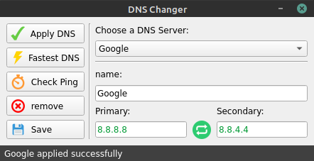
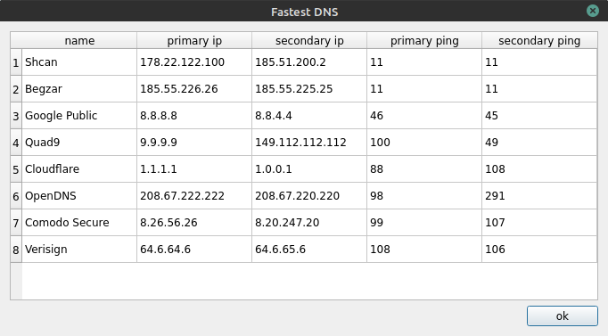

# Gui DNS changer for linux (version 2)
change dns of your system easily and quickly

tested on `ubuntu` and `mint`

### Screenshots



### Installation
```
git clone https://github.com/mrmoein/GUI-DNS-changer-for-linux
cd GUI-DNS-changer-for-linux
python3 install.py
```

search for `DNS changer` app